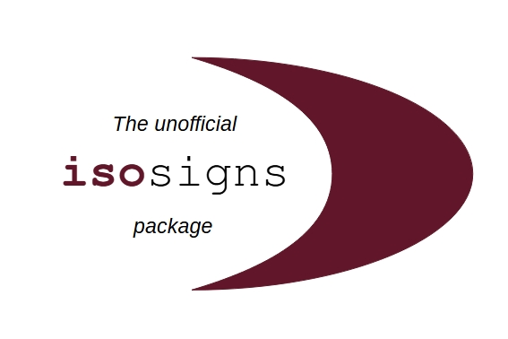

<p align="center">
  <a href="https://www.ctan.org/pkg/isosigns">
    
  </a>
</p>

<h3 align="center">isosigns</h3>

<p align="center">
  ISO signs and colors according to the standards 7001, 7010 and 3864
  <br>
  <a href="https://ftp.rrze.uni-erlangen.de/ctan/macros/latex/contrib/isosigns/doc/isosigns-docs.pdf"><strong>Explore the docs »</strong></a>
  <br>
  <br>
  <a href="https://github.com/BenSt099/isosigns/issues">Report bug</a>
  ·
  <a href="https://github.com/BenSt099/isosigns/issues">Request feature</a>
</p>

## isosigns

> **Warning**
This is _not_ an official package from ISO.

## Usage

```tex
 %%% Example file   
    \documentclass{article}
    
        \usepackage{isosigns}

    \begin{document}

            \Isosign{14} 

            \Isosign[scale=0.2,angle=90]{29} 

    \end{document}
```

## Attention

The package was renamed from __isosafety__ to __isosigns__. The update fixed color and size issues and also brought new signs to the package.
All packages named __isosafety-v.X__ are deprecated (versions v1.1 and v1.2 contain bugs).

## Documentation

The documentation can be viewed [here](https://github.com/BenSt099/isosigns/blob/main/isosigns/doc/isosigns-docs.pdf).

## Contributors

Thanks for all the feedback / comments / issues / contributions that made this package even better:

- [@hseliger](https://github.com/hseliger)

- [@quark67](https://github.com/quark67)

- [@SwitWu](https://github.com/SwitWu)

- [@samcarter](https://github.com/samcarter)

- [@0xflotus](https://github.com/0xflotus)

## Issues

In case of an issue, please provide a detailed description [here](https://github.com/BenSt099/isosafety/issues).

## License

This project is licensed under the [The LaTeX Project Public License 1.3c](https://www.ctan.org/license/lppl1.3c).